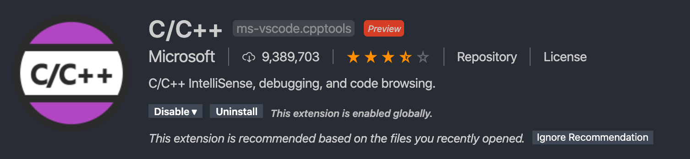

<CreateTime/>
<TagLinks />

本文记录在 Mac 上使用 Vscode 配置 C/C++开发环境的过程。

### 安装 CLT，详见《Mac 开发中遇到的问题》

### 安装 C/C++插件



### 几个配置文件

- c_cpp_properties.json

```json
{
  "configurations": [
    {
      "name": "Mac",
      "includePath": [
        "${workspaceFolder}/**",
        "/Library/Developer/CommandLineTools/usr/include/c++/v1",
        "/usr/local/include",
        "/Library/Developer/CommandLineTools/usr/lib/clang/11.0.0/include",
        "/Library/Developer/CommandLineTools/usr/include"
      ],
      "defines": [],
      "macFrameworkPath": [
        "/Library/Developer/CommandLineTools/SDKs/MacOSX.sdk/System/Library/Frameworks"
      ],
      "compilerPath": "/usr/bin/clang",
      "cStandard": "c11",
      "cppStandard": "c++17",
      "intelliSenseMode": "clang-x64"
    }
  ],
  "version": 4
}
```

- launch.json

```json
{
  "version": "0.2.0",
  "configurations": [
    {
      "name": "(lldb) Launch",
      "type": "cppdbg",
      "request": "launch",
      "program": "${workspaceFolder}/a.out",
      "args": [],
      "stopAtEntry": false,
      "cwd": "${workspaceFolder}",
      "environment": [],
      "externalConsole": true,
      "MIMode": "lldb"
    }
  ]
}
```

- tasks.json

```json
{
  "version": "2.0.0",
  "tasks": [
    {
      "label": "hello world",
      "type": "shell",
      "command": "clang++",
      "args": ["main.cpp"],
      "group": {
        "kind": "build",
        "isDefault": true
      }
    }
  ]
}
```
