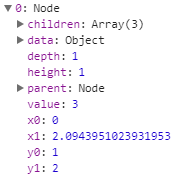

今天开个坑，记录一下自己用 d3 写的一个控件的实现过程。

首先准备一下按钮盘的构建数据。如下：

```json
{
  "name": "flare",
  "children": [
    {
      "name": "btn1",
      "children": [
        { "name": "btn1-1", "value": 1 },
        { "name": "btn1-2", "value": 1 },
        { "name": "btn1-3", "value": 1 }
      ]
    },
    {
      "name": "btn2",
      "children": [
        { "name": "btn2-1", "value": 1 },
        { "name": "btn2-2", "value": 1 },
        { "name": "btn2-3", "value": 1 }
      ]
    },
    {
      "name": "btn3",
      "children": [
        { "name": "btn3-1", "value": 1 },
        { "name": "btn3-2", "value": 1 },
        { "name": "btn3-3", "value": 1 }
      ]
    }
  ]
}
```

以上数据是用来构建一个双层按钮盘的数据，第一层是 3 个按钮，第二层是 9 个按钮。第一层每个按钮分别对应第二层的三个按钮。那么，第一步是要把原始数据转换成 d3 能用的，代码如下：

```js
const root = d3
  .hierarchy(this.div_data)
  .sum(d => d.value)
  .sort((a, b) => b.value - a.value);
const div_data_root = d3.partition().size([2 * Math.PI, root.height + 1])(root);
const div_data_root_des = div_data_root.descendants().slice(1);
```

最后得到的这个 div_data_root_des 就是我们要的，它长这样：

```json
[Node, Node, Node, ..., Node]
```

一共有 12 个 Node，也就是把树形的原始数据重构成了一元数组。

每个 Node 的结构是这样的：



可以看到，d3 帮你做了很多工作。为你确定了 depth、x0、x1、y0、y1 等属性。实际上，这些参数是用来绘制层级图的。但是到目前为止还不够，我们还需要进一步改造数据，以符合我们要绘制的光晕图效果。不过这个就要在结合在绘制的过程中做了。接下来，我们就开始绘制按钮盘。

首先确定圆心的位置：

```js
const g = this.svg.append("g").attr("transform", `translate(${x},${y})`);
```

接下来绘制每个按钮：

```js
const path = g
  .append("g")
  .selectAll("path")
  .data(div_data_root_des)
  .join("path")
  .attr("fill", "#409EFF")
  .attr("fill-opacity", d => (initArcVisible(d) ? 1 : 0))
  .attr("d", d => {
    return arc(d);
  });

var arc = d3
  .arc()
  .startAngle(d => d.x0)
  .endAngle(d => d.x1)
  .padAngle(d => Math.min((d.x1 - d.x0) / 2, 0.005))
  .padRadius(radius * 1.5)
  .innerRadius(d => d.y0 * radius)
  .outerRadius(d => Math.max(d.y0 * radius, d.y1 * radius - 1));

function initArcVisible(d) {
  if (d.depth == 1) return true;
  else return false;
}
```

可以看到，当 path 设置完填充色、显影控制等之后，我们自定义了一个很重要的函数`arc`，正是这个函数帮助我们绘制出每个按钮的长边圆弧、短边圆弧，并定位。而`initAcrVisible`这个函数在初始化时，将 depth=1，也就是第一层的按钮显示，第二层的子按钮全部隐藏。这里我们顺带着就知道了之前 d3 为我们做好的数据中`depth`这个属性的作用。

接着我们为按钮添加点击事件，功能主要是当点击的是第一层的母按钮时，显示挂在它之下的子按钮：

```js
path
  .filter(d => d.children)
  .style("cursor", "pointer")
  .on("click", firstClassBtnClick);

function firstClassBtnClick(p) {
  let select_btn = p.data.name;
  path.attr("fill-opacity", d => (changeArcVisible(d, select_btn) ? 1 : 0));
}

function changeArcVisible(d, select_btn) {
  if (d.depth == 2) {
    if (d.parent.data.name == select_btn) return true;
    else return false;
  } else {
    return true;
  }
}
```

最后我们给点击目标添加一个点击事件，来关闭按钮盘：

```js
g.append("circle")
  .datum(div_data_root)
  .attr("r", radius)
  .attr("fill", "none")
  .attr("pointer-events", "all")
  .on("click", cancelClick);

function cancelClick(e) {
  g.remove();
}
```

至此按钮盘我们就弄好了，当然，我们还要往上面添加图标，这个后面再补充吧。现在我们想让整个按钮盘是在右键目标后出现，代码如下：

```js
this.svg = d3.select(this.$refs.cus2_btn_container).append("svg");
this.svg.attr("viewBox", [0, 0, 320, 320]);
// 初始化各节点的g标签容器
this.nodes = this.svg
  .selectAll("g")
  .data(this.nodes_data)
  .enter()
  .append("g")
  .attr("transform", function(d) {
    return "translate(" + d.x + "," + d.y + ")";
  });
// 添加圆形背景
this.nodes
  .append("circle")
  .attr("class", "node")
  .attr("r", 10);

let that = this;
this.nodes.on("auxclick", function(e) {
  that.handleOpenDivDisk(e.x, e.y);
});
```

这一段代码，其实前面都是初始化，我们选定了当前页面的 svg 实例，设置 viewBox，添加节点，最后加一个 auxclick 的事件，就能响应右键点击了。然后我们把之前写的所有代码都放到这个新定义的函数`handleOpenDivDisk`里，把对象的坐标传进去使用，就 ok 啦。

(未完待续)
