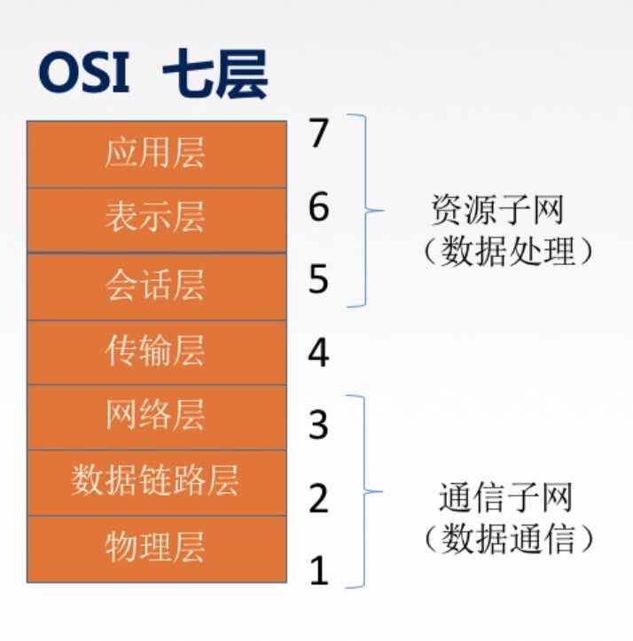

<CreateTime/>
<TagLinks />

摘抄自[💗 前端需要了解的计算机网络知识， 这一篇就够了！(图文并茂，万字长文，点赞收藏哦！)](https://juejin.im/post/5e51febde51d4526c932b390)

## 计算机网络概念

计算机网络是一个将分散的、具有独立功能的`计算机系统`， 通过`通信设备`与`线路`连接起来，由功能完善的`软件`实现资源共享和信息传递的系统。

这里需要注意的是，按分布范围，计算机网络里有`局域网LAN`和`广域网WAN`，其中`局域网`的代表是`以太网`，以及这两种网络最重要的区分点，`局域网`基于`广播技术`，`广域网`基于`分组交换`技术。（这些概念听一下就行，后面会详细介绍，因为理解广播和分组交换技术，大体上就理解了局域网和广域网）

## 衡量计算机网络性能的指标

这些内容主要是为了学习后面具体的协议，以及分析这些协议的报文时，需要掌握的基本概念。

### 速率

速率就是数据传输（数据是指 0 和 1）的速率，比如你用迅雷下载，1 兆每秒，来衡量目前数据传输的快慢。它是计算机网络中最重要的一个性能指标。

### 带宽

在计算机网络中，网络带宽是指在单位时间（一般指的是 1 秒钟）内能传输的数据量，比如说你家的电信网络是 100 兆比特，意思是，一秒内最大的传输速率是 100 兆比特。

### 吞吐量

吞吐量表示在单位时间内通过某个网络（或信道、接口）的数据量。

以上三点，我们举个案例：

- 一条路每秒最多能过 100 辆车（带宽就相当于 100 辆/秒）。

- 而并不是每秒都会有 100 辆车过，假如第一秒有 0 辆，第二秒有 10 辆...，（但是最多不能超过 100 辆）。

- 所以有第 1 秒 0 辆/秒，第 2 秒 10 辆/秒，第 3 秒 30 辆/秒，这不能说带宽多少吧，于是就用吞吐量表示具体时间通过的量有多少（也有可能等于带宽的量）。

- 由此可知带宽是说的是最大值速率，吞吐量说的是某时刻速率。但吞吐量不能超过最大速率。

### 时延

时延是指数据（报文/分组/比特流）从网络（或链路）的一端传送到另一端所需的时间。单位是 s。 时延分一下几种：

- 发送时延
  就是说我跟你说话，从我开始说，到说话结束这段时间，就是`发送时延`。

- 传播时延
  信道上第一个比特开始，到最后一个比特到达主机接口需要的时间就是`传播时延`。

- 排队时延

  - 分组在经过网络传输时，要经过很多的`路由器`。
  - 但分组在进入路由器后要先在输入队列中`排队等待`处理。
  - 在路由器确定了转发接口后，还要在输出队列中排队等待转发，这就产生了`排队时延`。
  - 排队时延的长短往往取决于网络当时的通信量，当网络的通信量很大时会发生排队溢出，为`分组丢失`。

- 处理时延
  `路由器`或`主机`在收到数据包时，要花费一定时间进行处理，例如`分析数据包的首部`，进行`首部差错检验`，`查找路由表`为数据包选定准发接口，这就产生了`处理时延`。

- 往返时间 RTT（Round-Trip Time）
  在计算机网络中，往返时间也是一个重要的性能指标，它表示从发送方发送数据开始，到发送方收到来自接收方的确认（接受方收到数据后便立即发送确认）`总共经历的时间`

- 时延带宽积
  是指传播时延乘以带宽

### 正文开始！OSI 参考模型

`OSI`参考模型是网络互连的`七层`框架，这里不详细介绍了，每一层的具体内容会在后面介绍，这里只需要有一个初步的印象。

如下图所示，1，2，3 层主要是是`物理链路`组成的，比如`光纤`，`路由器`，`集线器`，主要负责的是`数据通信`。5，6，7 层是`软件控制`的，比如`http协议`，是一种软件层面控制的协议，主要负责处理传输来的`数据`。

