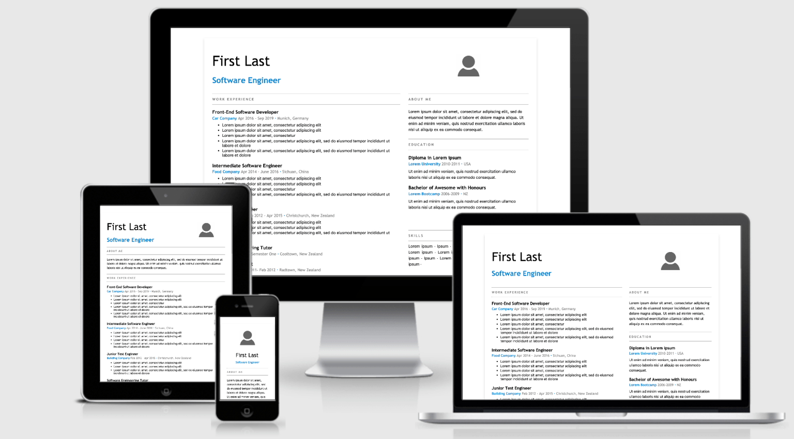

<CreateTime/>
<TagLinks />

原文链接：
[New Year, New Job? Let’s Make a Grid-Powered Resume!](https://css-tricks.com/new-year-new-job-lets-make-a-grid-powered-resume/)

许多流行的简历设计通过将各个部分布置为网格状来充分利用可用的页面空间。让我们使用 CSS Grid 来创建一个打印和在不同屏幕尺寸下都看起不错的布局。这样，我们可以在线或离线地使用，在新的一年里以备无患。

_TODO_
